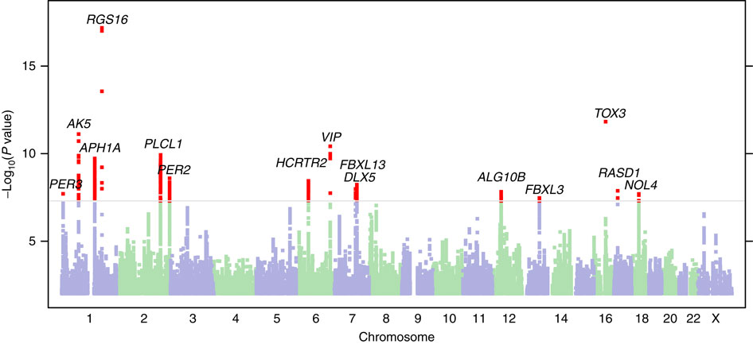

# Manhattan plot

## What does it show?
For **one** disease or phenotype, the significance (read `-log(pvalue)`) of **many** SNPs, often across **many** chromosomes.

## What does a user do with it?
Looks for significant SNPs/loci to **investigate further**. *What further investigation is done? Presumably it's always localised to the region of the significant locus?*

## Where is the data from?

## Observations across examples
* Sometimes significant loci are marked with a gene. *On what basis? Nearest to the locus?*
* Often a significance cutoff line is marked at about `-log(pvalue) = 8`. *What determines this, or is it a generally agreed figure?*

## Examples

